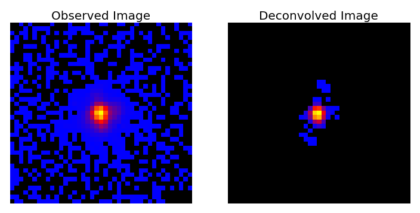

SF_DECONVOLVE
=============

> Author: **Samuel Farrens**  
> Year: **2017**  
> Version: **4.0**  
> Email: [samuel.farrens@gmail.com](mailto:samuel.farrens@gmail.com)  
> Website: [sfarrens.github.io](https://sfarrens.github.io/)  
> Reference Paper: [arXiv:1703.02305](https://arxiv.org/abs/1703.02305)

Contents
------------
1. [Introduction](#intro_anchor)
1. [Dependencies](#depend_anchor)
1. [Execution](#exe_anchor)
    1. [Input Format](#in_format)
    1. [Running the executable script](#py_ex)
    1. [Running the code in a Python session](#py_sesh)
    1. [Example](#eg_anchor)
    1. [Code Options](#opt_anchor)
1. [Troubleshooting](#trouble)

<a name="intro_anchor"></a>
## Introduction

This repository contains a Python code designed for PSF deconvolution and analysis.

The directory ``lib`` contains all of the primary functions and classes used for optimisation and analysis.


<a name="depend_anchor"></a>
## Dependencies

In order to run the code in this repository the following packages must be installed:

* **[Python 2.7](https://www.python.org/download/releases/2.7/)</a>**
[Tested with v 2.7.11]

* **[Numpy](http://www.numpy.org/)** [Tested with v 1.11.3]

* **[Scipy](http://www.scipy.org/)** [Tested with v 0.18.1]

* **[Astropy](http://www.astropy.org/)** [Tested with v 1.1.2]

* **[Matplotlib](http://matplotlib.org/)** [Tested with v 1.5.3]

* **[Termcolor](https://pypi.python.org/pypi/termcolor)** [Tested with v 1.1.0]

* **[sf_tools](https://sfarrens.github.io/sf_tools/)** [Tested with v 1.0]

* The current implementation of wavelet transformations additionally requires the `mr_transform.cc` C++ script from the Sparse2D library in the **[iSap](http://www.cosmostat.org/software/isap/)** package [Tested with v 3.1]. These C++ scripts will be need to be compiled in order to run (see [iSap Documentation](http://www.cosmostat.org/wp-content/uploads/2014/12/doc_iSAP.pdf) for details).

The low-rank approximation method can be run purely in Python.

<a name="exe_anchor"></a>
## Execution

The primary code is an executable script called ``sf_deconvolve.py`` which is designed to take an observed (*i.e.* with PSF effects and noise) stack of galaxy images and a known PSF, and attempt to reconstruct the original images. The input format are Numpy binary files (.npy) or FITS image files (.fits).

<a name="in_format"></a>
### Input Format

The input files should have the following format:

- Input Images: This should be either a Numpy binary or a FITS file containing a 3D array of galaxy images. *e.g.* for a sample of 10 images, each with size 41x41, the shape of the array should be [10, 41, 41].

- Input PSF(s): This should be either a Numpy binary or a FITS file containing a 2D array (for a fixed PSF) or a 3D array (for a spatially varying PSF) of PSF images. For the spatially varying case the number of PSF images must match the number of corresponding galaxy images. *e.g.* For a sample of 10 images the codes expects 10 PSFs.

See the files provides in the `examples` directory for reference.

<a name="py_ex"></a>
### Running the executable script

The code can be run in a terminal (not in a Python session) as follows:

```bash
$ sf_deconvolve.py -i INPUT_IMAGES.npy -p PSF.npy -o OUTPUT_NAME
```

Where `INPUT_IMAGES.npy` denotes the Numpy binary file containing the stack of observed galaxy images, `PSF.npy` denotes the PSF corresponding to each galaxy image and `OUTPUT_NAME` specifies the output path and file name.

Alternatively the code arguments can be stored in a configuration file (with any name) and the code can be run by providing
the file name preceded by a `@`.

```bash
$ sf_deconvolve.py @config.ini
```

An example configuration file is provided in the `examples` directory.

<a name="py_sesh"></a>
### Running the code in a Python session

To run the code in an active Python session you should include the following imports:

```Python
>>> from lib.deconvolve import run
>>> from functions.log import set_up_log
```

*Note:* At present it is necessary to create a logging session but this may be relaxed in a future update.

The code can then be run as follows:

```Python
>>> log = set_up_log('LOG_FILE_NAME')
>>> primal_res, dual_res = run(INPUT_IMAGES, INPUT_PSFS, log=log, **KEYWORDS)
```

Where `INPUT_IMAGES` and `INPUT_PSFS` are both Numpy arrays and `KEYWORDS` is a dictionary that contains all of the parameter settings (this requires defining values for virtually all of the arguments listed [below](#opt_anchor)). The resulting deconvolved images will be saved to the variable `primal_res`.

<a name="eg_anchor"></a>
### Example

The following example can be run on the sample data provided in the ``example`` directory.

This example takes a sample of 100 galaxy images (with PSF effects and added noise) and the corresponding PSFs, and recovers the original images using low-rank approximation via Condat-Vu optimisation.

```bash
$ sf_deconvolve.py -i example_image_stack.npy -p example_psfs.npy -o example_output --mode lowr
```

The example can also be run using the configuration file provided.

The result will be two Numpy binary files called `example_output_primal.npy` and `example_output_dual.npy` corresponding to the primal and dual variables in the splitting algorithm. The reconstructed images will be in the `example_output_primal.npy` file.

The example can also be run with the FITS files provided.

<a name="opt_anchor"></a>
### Code Options

#### Required Arguments

* **-i INPUT, --input INPUT:** Input data file name. File should be a Numpy binary containing a stack of noisy galaxy images with PSF effects (*i.e.* a 3D array).

* **-p PSF, --psf PSF:** PSF file name. File should be a Numpy binary containing either: (a) a single PSF (*i.e.* a 2D array for *fixed* format) or (b) a stack of PSFs corresponding to each of the galaxy images (*i.e.* a 3D array for *obj_var* format).

#### Optional Arguments

* **-h, --help:** Show the help message and exit.

* **-v, --version:** Show the program's version number and exit.

* **-q, --quiet:** Suppress verbose for each iteration.

* **-o, --output:** Output file name. If not specified output files will placed in input file path.

* **--output_format** Output file format [npy or fits].

*Initialisation:*

* **-k, --current_res**: Current deconvolution results file name (*i.e.* the file containing the primal results from a previous run).

* **--noise_est:** Initial estimate of the noise standard deviation in the observed galaxy images. If not specified this quantity is automatically calculated using the median absolute deviation of the input image(s).

*Optimisation:*

* **-m, --mode {all,sparse,lowr,grad}:** Option to specify the optimisation mode [all, sparse, lowr or grad]. *all* performs optimisation using both low-rank approximation and sparsity, *sparse* using only sparsity, *lowr* uses only low-rank and *grad* uses only gradient descent. (default: lowr)

* **--opt_type {condat,fwbw,gfwbw}:** Option to specify the optimisation method to be implemented [condat, fwbw or gfwbw]. *condat* implements the Condat-Vu proximal splitting method, *fwbw* implements Forward-Backward splitting with FISTA speed-up and *gfwbw* implements the generalised Forward-Backward splitting method. (default: condat)

* **--n_iter:** Number of iterations. (default: 150)

* **--cost_window:** Window to measure cost function (*i.e.* interval of iterations for which cost should be calculated). (default: 1)

* **--convergence:** Convergence tolerance. (default: 0.0001)

* **--no_pos:** Option to turn off positivity constraint.

* **--grad_type:** Option to specify the type of gradient [psf_known, psf_unknown, none]. *psf_known* implements deconvolution with PSFs provided, *psf_unknown* simultaneously improves the PSF while performing the deconvolution, *none* implements deconvolution without gradient descent (for testing purposes only). (default: psf_known)

*Low-Rank Aproximation:*

* **--lowr_thresh_factor:** Low rank threshold factor. (default: 1)

* **--lowr_type:** Type of low-rank regularisation [standard or ngole]. (default: standard)

* **--lowr_thresh_type:** Low rank threshold type [soft or hard]. (default: hard)

*Sparsity:*

* **--wavelet_type:** Type of Wavelet to be used (see [iSap Documentation](http://www.cosmostat.org/wp-content/uploads/2014/12/doc_iSAP.pdf)). (default: 1)

* **--wave_thresh_factor:** Wavelet threshold factor. (default: [3.0, 3.0, 4.0])

* **--n_reweights:** Number of reweightings. (default: 1)

*PSF Estimation*

* **--lambda_psf:** Regularisation control parameter for PSF estimation. (default: 1.0)
* **--beta_psf:** Gradient step for PSF estimation. (default: 1.0)

*Condat Algorithm:*

* **--relax:** Relaxation parameter (rho_n in Condat-Vu method). (default: 0.8)

* **--condat_sigma:** Condat proximal dual parameter. If the option is provided without any value, an appropriate value is calculated automatically. (default: 0.5)

* **--condat_tau:** Condat proximal primal parameter. If the option is provided without any value, an appropriate value is calculated automatically. (default: 0.5)

*Testing:*

* **-c, --clean_data:** Clean data file name.

* **-r, --random_seed:** Random seed. Use this option if the input data is a randomly selected subset (with known seed) of the full sample of clean data.

* **--true_psf:** True PSFs file name.

* **--kernel:** Standard deviation of pixels for Gaussian kernel. This option will multiply the deconvolution results by a Gaussian kernel.

* **--metric:** Metric to average errors [median or mean]. (default: median)

<a name="trouble"></a>
## Troubleshooting

* If you get the following error:

`ERROR: svd() got an unexpected keyword argument 'lapack_driver'`

Update your Numpy and Scipy installations

```bash
$ pip install --upgrade numpy
$ pip install --upgrade scipy
```
